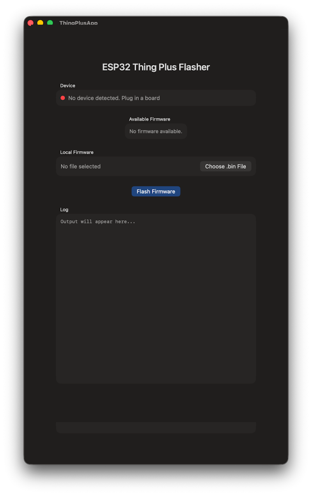
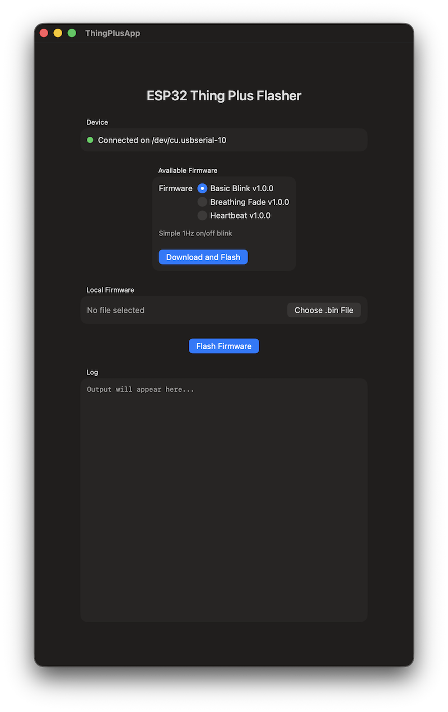
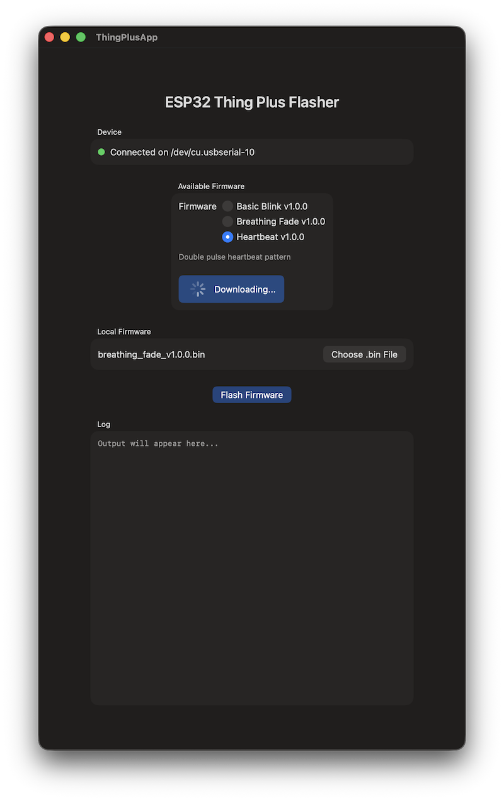
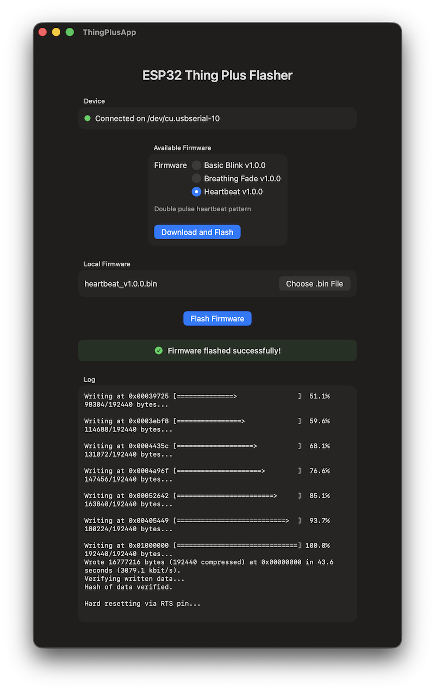

# ESP32 Thing Plus Flasher

A native macOS firmware updater for the SparkFun Thing Plus ESP32 WROOM development board.

---



*App on launch. No device connected.*

---

## Overview

ESP32 Thing Plus Flasher is a simple, self-contained macOS application that allows users to flash firmware `.bin` files to the SparkFun Thing Plus ESP32 WROOM over USB.

The app supports two methods of flashing firmware:

**Remote Firmware.** The app fetches a list of available firmware versions from a hosted `manifest.json` file. The user selects a version from the list and the app downloads and flashes it automatically.

**Local Firmware.** The user selects a `.bin` file from their Mac using the built-in file picker and flashes it directly.

---

## Demo

[](https://youtu.be/ctbrApIzgSY)  
*Click to watch the app in action on YouTube.*

---

## Screenshots

  
*Board detected. Green indicator confirms the USB serial port is active.*

  
*Firmware downloading from GitHub before flashing begins.*

  
*Firmware flashed successfully. The log shows the full esptool output.*

---

## Features

- **Auto-detects** the connected ESP32 board via USB serial port
- **Remote firmware list** fetched from a hosted manifest file
- **Local file picker** for flashing a `.bin` file directly from your Mac
- **One-button flashing.** No command line required.
- **Live log output** with real-time progress during flash
- **Clear success and failure feedback**
- **Fully self-contained.** esptool is bundled inside the app. No Python or external tools are needed.

---

## Tested Environment

This project has been developed and tested in the following environment. Behaviour on other configurations is unknown.

| Component | Detail |
|---|---|
| macOS | Tahoe 26.3 |
| Xcode | 26.3 (17C529) |
| Hardware | MacBook Pro 16" M3 Pro (Apple Silicon) |
| Arduino IDE | 2.3.8 |
| ESP32 Arduino Core | 3.3.8 (Espressif Systems) |
| Test board | SparkFun Thing Plus ESP32 WROOM (WRL-15663) |
| esptool | v5.2.0 (arm64) |

The app minimum deployment target is **macOS 14.6 Sonoma**. The binary has been tested on macOS Tahoe 26.3. It has not been tested on Sonoma or Sequoia. It may work on those versions but this is not guaranteed.

---

## Requirements

| Requirement | Detail |
|---|---|
| macOS | 14.6 Sonoma or later |
| Architecture | Apple Silicon (arm64) |
| Board | SparkFun Thing Plus ESP32 WROOM (WRL-15663) |
| USB Driver | CP2104 - included with macOS or available from Silicon Labs |

---

## Target Hardware

Developed and tested against the **SparkFun Thing Plus ESP32 WROOM (WRL-15663)**:

- **SoC:** ESP32-D0WD-V3 (revision 3.1)
- **Flash:** 16MB
- **USB Bridge:** CP2104
- **Programmable LED:** GPIO 13 (Blue)
- **Crystal:** 40MHz

---

## Installation

A pre-built binary is provided for Apple Silicon Macs running macOS 14.6 or later.

1. Download `ThingPlusApp.zip` from the [Releases](https://github.com/jimmcmillan/ESP32ThingPlusFlasher/releases) section
2. Unzip the file
3. Move `ThingPlusApp.app` to your Applications folder or run it directly

The distributed binary has been notarized via Xcode Direct Distribution and signed with a Developer ID certificate. On first launch macOS may still present a security prompt. Right-click the app and select **Open** to proceed.

---

## Using the App

### Remote Firmware

1. Connect your ESP32 Thing Plus board via USB
2. Wait for the Device indicator to turn green
3. Select a firmware version from the **Available Firmware** list
4. Click **Download and Flash**
5. Wait for the log to show `Hash of data verified` and the green success banner to appear

### Local Firmware

1. Connect your ESP32 Thing Plus board via USB
2. Wait for the Device indicator to turn green
3. Click **Choose .bin File** and select a compiled merged `.bin` file
4. Click **Flash Firmware**
5. Wait for the log to show `Hash of data verified` and the green success banner to appear

### Firmware Files

The app accepts **merged `.bin` files.** These are single binary files that combine the bootloader, partition table, boot selector, and application into one file flashed to address `0x0`.

These are produced automatically by Arduino IDE 2.x via **Sketch -> Export Compiled Binary**. Look for the file ending in `.ino.merged.bin` inside the sketch's `build/` folder.

---

## Remote Firmware: How It Works

The app fetches a `manifest.json` file from a hosted URL on launch. The manifest lists all available firmware versions. The app decodes the manifest and presents the entries as a selectable list.

### Manifest Format

```json
{
  "firmware": [
    {
      "version": "1.0.0",
      "name": "Basic Blink",
      "description": "Simple 1Hz on/off blink",
      "filename": "basic_blink_v1.0.0.bin",
      "url": "https://raw.githubusercontent.com/username/repo/main/firmware/basic_blink_v1.0.0.bin"
    }
  ]
}
```

### Adapting for Your Own Project

If you fork this project for your own firmware distribution, two things need to change:

1. Update the manifest URL in `FlashViewModel.swift`. Search for `fetchManifest()` and replace the hardcoded URL with your own.
2. Host your own `manifest.json` and `.bin` files at that URL.

No other changes to the app are required. Adding or removing firmware versions is done entirely by editing the manifest file on the server. The app picks up the changes automatically on next launch.

---

## Building from Source

1. Clone or download the repository
2. Open `ThingPlusApp.xcodeproj` in Xcode 26.3 or later
3. Select your development team under **Signing and Capabilities**
4. Ensure **App Sandbox** is disabled — required for subprocess execution
5. Build and run with **Cmd+R**

The `esptool` binary is included in the repository and copied into the app bundle automatically at build time via **Copy Bundle Resources**.

### esptool Binary

The bundled `esptool` binary was compiled from the esptool Python source using **Nuitka**, a Python to native C compiler. Unlike the official Espressif pre-built binaries which are packaged with PyInstaller, this binary is a native arm64 executable with no embedded Python framework or runtime dependency.

This matters because PyInstaller based binaries fail at runtime when launched from within a macOS app bundle due to Team ID conflicts with the embedded Python framework. The Nuitka compiled binary does not have this issue.

The binary included in this repository is **unsigned**. Before building and running the app you will need to sign it with your own Apple Developer ID certificate:

```bash
codesign --force --sign "Developer ID Application: Your Name (TEAMID)" /path/to/esptool
```

Then strip the quarantine flag:

```bash
xattr -dr com.apple.quarantine /path/to/esptool
```

If you need to rebuild the binary from source:

1. Install Nuitka using CPython from python.org. Apple's bundled Python is not supported by Nuitka.
2. Compile esptool using:
```bash
python3 -m nuitka --onefile --output-filename=esptool /path/to/esptool/__main__.py
```
3. Sign and strip quarantine as above before adding to Xcode.

---

## Bundled esptool

The app bundles a custom compiled esptool binary for macOS arm64.

| Property | Detail |
|---|---|
| Version | v5.2.0 |
| Architecture | arm64 (Apple Silicon) |
| Build tool | Nuitka 4.1 (compiled from source) |
| Source | [Espressif esptool](https://github.com/espressif/esptool) |
| Licence | GPL v2 |

---

## Licence

### This Repository

This project is licensed under the **GNU General Public License v2 (GPL v2)**.

The bundled `esptool` binary is GPL v2 licensed by Espressif Systems.

What this means for you:

- You are free to use, copy, modify, and distribute this software
- Any distribution of this software or a modified version of it must also be released under GPL v2
- The source code must be made publicly available
- You cannot use this code as the basis for a closed-source or commercial product while the esptool dependency remains

The full GPL v2 licence text is included in the `LICENSE` file in this repository.

### esptool

esptool is copyright Espressif Systems and is licensed under GPL v2. Source: [https://github.com/espressif/esptool](https://github.com/espressif/esptool)

---

## Support, Contributions and Disclaimer

**This project is provided as-is.**

It is test software, shared publicly for reference. It is not actively maintained.

- **Issues and bug reports** will not be monitored or responded to
- **Pull requests and contributions** will not be accepted
- **Forks are welcome**

**Use entirely at your own risk.**

Flashing firmware to hardware carries an inherent risk of rendering a device inoperable if something goes wrong. The author accepts no responsibility for damage to hardware, data loss, voided warranties, or any other consequence arising from the use of this software, the source code, or the firmware files in this repository.

This software is provided without warranty of any kind, express or implied, including but not limited to warranties of merchantability, fitness for a particular purpose, or non-infringement.

**By using this software you accept these terms in full.**
